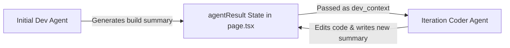

# Changelog

All notable changes to the **AI Agent Developer** platform are documented in this file.

---

## [2.2.1] - 2026-05-29

### Bugfix — Dev-Iterate Diff Panel Never Appearing

**Root Cause 1 — Backend (`routers/iterate.py`)**: The `result` SSE event was only emitted `if result.get("summary")`. When the agent finishes without calling `report_task_status` (e.g. exits via a direct final answer), `summary` is empty and the event is never sent. The frontend's `agentResult` state stays `""`, which causes `DevChat` to return `null` entirely — hiding the whole component including the diff button.

**Root Cause 2 — Frontend (`DevChat.tsx`)**: Even when `DevChat` renders, the diff panel was gated behind `workspaceDiff &&`. If `git diff --relative` returned an empty string (e.g. files were written but the workspace isn't a git repo, or changes haven't been staged), the button was silently invisible.

**Fixes:**
- **`backend/routers/iterate.py`**: Always emit a `result` event on iteration completion. If the agent provided a real summary, use it; otherwise emit a generic `"Iteration completed with status: {status}."` fallback. This guarantees `agentResult` is always set and `DevChat` always mounts.
- **`frontend/DevChat.tsx`**:
  - Added `iterateHasRun` local state, set to `true` when the component first mounts (i.e. after any iteration).
  - Diff panel now shows if `workspaceDiff || iterateHasRun` — always visible after a run.
  - When `workspaceDiff` is empty, the badge reads `"no unstaged changes"` (instead of showing nothing) and the button action becomes a **Refresh** to re-fetch the diff.
  - When `workspaceDiff` is populated, behaviour is unchanged: badge shows `"unstaged modifications"`, button toggles expand/collapse.

---

## [2.2.0] - 2026-05-29


### Feature — Devtools Safety Hardening (Option A: AST Guard + Anchored Transactions)

Hardened the dev-agent's file-editing and command-execution toolset to prevent codebase corruption, unsafe shell execution, and runaway retry loops.

#### New Files

| File | Responsibility |
|---|---|
| `backend/syntax_guard.py` | Pure validation engine: `ast.parse` for `.py`, `json.loads` for `.json`, 2 MB size cap, thread-safe 3-strike failure budget per agent run |
| `backend/tests/test_syntax_guard.py` | 56-case pytest suite covering all safety guardrails end-to-end |

#### Modified Files

**`backend/dev_tools.py`**
- **Command blocklist** added to `TerminalExecutionTool.run()`: 12 regex patterns block catastrophic shell commands (`rm -rf /`, `format c:`, `shutdown`, `reboot`, `halt`, `curl|sh`, `wget|sh`, base64 PowerShell, `iex`, `mkfs`) before execution — checked prior to HITL approval
- **Per-file thread lock registry**: module-level `_file_locks: defaultdict(threading.Lock)` ensures concurrent writes to the same path are serialised
- **Syntax + size validation** wired into all write paths via `_validate_and_guard()` helper:
  - `WriteFileTool` — validates before creating/overwriting the file
  - `ReplaceInFileTool` — validates resulting content before committing the replacement
  - `EditFileLinesTool` — reconstructs full file content in-memory, validates, then writes
  - `InsertAtLineTool` — same reconstruct-validate-write pattern
- **`BatchReplaceFileContentTool`** (new tool): transactional multi-chunk replacement
  - All anchors (`target_content`) are validated for exact-one-match on the original file before any edit is applied
  - Chunks sorted and applied **bottom-to-top** by position to eliminate line-drift offset corruption
  - Any anchor miss, ambiguity, or post-edit syntax failure triggers a **full rollback** — file left untouched
  - Registered in `create_dev_tool_registry()` factory alongside existing tools
- Added `from syntax_guard import ...` import; added `from collections import defaultdict`

**`backend/agent_loop.py`**
- Imports `reset_failure_counts` from `syntax_guard`
- Calls `reset_failure_counts()` at the start of every `run_agent_loop()` invocation so the 3-failure budget is per-task, not sticky across runs

**`backend/config/agents.yaml`**
- `developer` and `iterative_developer` backstories expanded from single-line strings to block scalars
- Both personas now document: safety constraints (blocklist, syntax guard, size cap, failure budget) and preferred editing tool hierarchy (`batch_replace_file_content` → `replace_in_file` → `write_file`)
- `iterative_developer` explicitly warns against using `edit_file_lines`/`insert_at_line` with stale line numbers

**`backend/README.md`**
- Directory tree updated to include `syntax_guard.py`
- New §7 `syntax_guard.py` section added
- `dev_tools.py` section (now §8) rewritten to document all safety-hardened tools including `BatchReplaceFileContentTool`

#### No Breaking Changes
All existing tool names, schemas, API routes, and SSE event vocabulary are unchanged. `BatchReplaceFileContentTool` is purely additive.

---

## [2.1.0] - 2026-05-26


### Refactor — Backend Modularization (`main.py` Split)

`main.py` was 1146 lines. It has been decomposed into focused, importable modules with no behavior changes.

#### New Files

| File | Responsibility |
|---|---|
| `config.py` | Global state (`runtime_settings`, `approval_settings`, `BASE_WORKSPACE_DIR`, `_active_runs`), and all Pydantic request models |
| `helpers.py` | Pure utility functions: provider/model resolution, `validate_workspace_path`, `validate_chat_history`, `build_system_prompt`, `_emit` |
| `agent_loop.py` | `run_agent_loop()` — the LiteLLM streaming engine; `_emit_tool_result()` — structured SSE tool result emitter |
| `run_manager.py` | Per-request state lifecycle: `_make_run_state`, `_cleanup_run`, `_get_run` |
| `routers/settings.py` | `GET/POST /api/settings`, `GET /api/workspace/diff` |
| `routers/design.py` | `POST /api/design/chat` |
| `routers/develop.py` | `POST /api/develop` (SSE) |
| `routers/iterate.py` | `POST /api/dev-iterate` (SSE) |
| `routers/dev_chat.py` | `POST /api/dev-chat` |
| `routers/control.py` | `/api/develop/stop`, `/approve`, `/toggle-approval` |

#### Modified Files
- **`main.py`**: Reduced from 1146 lines to ~40 lines — now only wires routers, configures CORS, and guards `uvicorn.run`.
- **`backend/README.md`**: Updated to reflect the new modular structure.

#### No Behavior Changes
All API routes, SSE event vocabulary, and frontend interactions are identical.

---

## [2.0.0] - 2026-05-26


### Breaking Change — Backend Orchestration Rearchitected

Replaced the CrewAI agent framework entirely with a native `litellm` streaming loop using OpenAI-compatible function calling.

#### Why
- `StreamCatcher` was hijacking `sys.stdout` process-wide and regex-matching `Thought: / Action: / Observation:` from CrewAI's print output. Any upstream version bump would silently break the entire Terminal UI.
- `PatchedStream` + `_patched_completion` was a global monkeypatch on `litellm.completion` just to intercept thinking tokens — fragile by design.
- `abort_event` and `approval_state` were process-global threading primitives with TODO comments acknowledging they'd break under concurrent use.
- CrewAI was running three separate single-agent crews (designer, developer, iterative_developer) with `allow_delegation=False` — essentially single-turn loops with no multi-agent value.

#### What Changed

**`backend/dev_tools.py`**
- Removed `crewai.tools.BaseTool` inheritance from all tools
- Each tool is now a plain Python class with a `run()` method and `to_openai_schema()` for OpenAI function-calling format
- Added `ToolRegistry` class: holds all tool instances, exports schemas via `get_schemas()`, dispatches calls via `execute(name, args)` with Pydantic validation
- Added `create_dev_tool_registry()` factory (replaces the old `create_dev_tools()` list factory)

**`backend/design_tools.py`**
- Removed `BaseTool` inheritance from `UpdateSpecTool`
- Added `to_openai_schema()` method

**`backend/main.py`**
- **Added `run_agent_loop()`**: Native litellm streaming loop that replaces `Crew.kickoff()`. Uses structured JSON tool calls, accumulates streaming chunks, emits the exact same SSE events as before (`thought`, `tool_call`, `tool_input`, `tool_result`, `model_thinking`, `final_answer`, `result`). Iteration-safe with configurable `max_iter`.
- **Added `build_system_prompt()`**: Builds system prompts from `agents.yaml` `role`/`goal`/`backstory` fields (previously handled internally by CrewAI's Agent constructor).
- **Added per-request `RunState`**: Each `/api/develop` and `/api/dev-iterate` call creates its own `abort` and `approval_event` threading objects, keyed by `run_id` UUID. Fixes the process-global threading race condition.
- **Rewired `/api/design/chat`**: Now a single-turn `litellm.completion()` call with function calling — no Crew/Agent/Task construction.
- **Rewired `/api/develop`**: Calls `run_agent_loop()` in a background thread instead of `Crew.kickoff()`.
- **Rewired `/api/dev-iterate`**: Same treatment.
- **Deleted `StreamCatcher`** (~100 lines) — no longer needed, tool calls are structured JSON.
- **Deleted `PatchedStream`, `_patched_completion`, `_litellm.completion = _patched_completion`** — thinking tokens are now captured natively from stream chunks.
- **Deleted `CustomStreamCallback(BaseCallbackHandler)`** — LangChain callback no longer needed.
- **Deleted `_thread_local`, `_old_completion`** — artifacts of the monkeypatching approach.
- **Removed imports**: `crewai`, `langchain_core`

**`agent_workflow.py`** — Deleted (dead CrewAI demo script from early development).

#### Frontend — No Changes
The SSE event vocabulary (`thought`, `tool_call`, `tool_result`, `cmd_start`, `cmd_output`, `cmd_end`, `model_thinking`, `final_answer`, `result`, `action_required`, `done`) is unchanged. `Terminal.tsx`, `page.tsx`, and all other components are untouched.

---

## [1.2.1] - 2026-05-26

### Added & Improved
- **Premium Model Selection Experience (`ModelPicker.tsx`)**:
  - Completely redesigned the inline model selector into an ultra-premium glassmorphic controls dropdown.
  - Implemented fluid `framer-motion` scale-up and fade-in bottom-anchored animations for a seamless interactive feel.
  - Added an integrated **Segmented Provider Controller** at the top of the picker, allowing users to toggle between Google Gemini (crimson theme) and OpenAI (emerald theme) with a single click.
  - Engineered responsive active highlights, featuring glowing left indicator bars and custom colored checkmarks matching the provider's aesthetic.
  - Enhanced trigger button styling to include dynamic status breathing glows (rose/ruby for Gemini, emerald for OpenAI) and matching custom-colored model status icons.
  - Standardized component layouts to perfectly match the height of neighbor inputs across the platform (aligned to `h-11` in `DesignChat.tsx` and `h-[38px]` in `DevChat.tsx`).

## [1.2.0] - 2026-05-20

### Added
- **Real-Time Code Diff Review Drawer (`@pierre/diffs`)**:
  - Installed and integrated the `@pierre/diffs` visual code comparison library inside the frontend.
  - Dynamically imported `PatchDiff` with `{ ssr: false }` to avoid standard Next.js 16/React 19 SSR hydration mismatches since the library relies on browser-only web components.
  - Crafted a collapsible, responsive Code Diff panel right inside the `DevChat` component styled with matching industrial red accents (`#E51937`).
  - Added a backend `GET /api/workspace/diff` endpoint inside `backend/main.py` that safely runs `git diff --relative` on the workspace directory.
  - Linked SSE `done` handlers inside `page.tsx` for both develop and apply streams to trigger `fetchWorkspaceDiff()` upon compilation completion, letting you immediately inspect unstaged modifications side-by-side.

- **Live Token Usage Telemetry Dashboard**:
  - Implemented real-time token tracking to measure input, output, and total token usage across all active agent steps.
  - Added token usage aggregation to the design phase in `/api/design/chat` by extracting `crew.usage_metrics` upon task completion.
  - Added frontend state (`totalTokens`) to accumulate prompt, completion, and total tokens across the initial build (`/api/develop`), developer chat (`/api/dev-chat`), and refinement iteration (`/api/dev-iterate`) routes.
  - Formatted a high-contrast mono compiler badge in the `DevChat` header: `SYS // COMPILER_TUNING // TOKENS: X (P: Y | C: Z)`.
  - Added a global, glassmorphic floating telemetry panel in the main "Engineering Control Desk" header that dynamically slides in using Framer Motion to visualize live prompt and completion counts.

- **Terminal Scroll-Lock & Floating Resume Button**:
  - Implemented smart autoscroll-locking inside `Terminal.tsx`. Manually scrolling up inside the terminal immediately locks the view to prevent new incoming logs from hijacking scroll position.
  - Added a floating, micro-animated **"Resume Auto-Scroll"** button powered by Framer Motion that appears dynamically when scroll-lock is engaged.
  - Refactored `tool_result` output cards inside the terminal to be collapsed by default with interactive `[+ Expand details]` toggles.

### Fixed & Optimized
- **Token Passback Context Optimization**:
  - Diagnosed and resolved a quadratic context token explosion (which hit 1.8M input tokens during runs).
  - Cleaned up the dev chat history parser inside `backend/main.py` and `frontend/src/app/page.tsx` to strip huge, raw "changes-applied" blocks and cap history to the last 8 messages.
- **Scoping / Import Bug**:
  - Fixed a `NameError` crash where `CustomStreamCallback` was scoped within `generate_code_stream` but needed across different stream routes in `main.py`. Moved it cleanly to the global module scope.

---

## [1.1.0] - 2026-05-20

### Added
- **Workspace Reference Reference Documentation**:
  - Generated extremely detailed, comprehensive `README.md` files for both the `/backend/` and `/frontend/` directories documenting the directory structure, file responsibilities, design schemes, and setup details. This helps developers and LLM sub-agents easily map out and build on the codebase.

### Changed
- **Aesthetic Refactor (Industrial Red / Dark-Gray Theme)**:
  - Redesigned the core UI theme to feature a stunning, premium dark industrial manufacturing aesthetic utilizing `#E51937` red highlights, heavy-duty border weights, and high-contrast charcoal typography.

---

## 💡 Token Optimization Deep-Dive

### 1. Dual-Agent Architecture Explained
The platform separates responsibilities between two distinct LLM roles:
* **The Dev Chat Agent (Conversational Drawer)**: Powered by the `/api/dev-chat` endpoint. It sits in the frontend chat interface, acts as an advisor, answers conceptual or structural queries, and drafts plans.
* **The Developer Agent (Background Code Builder)**: Powered by `/api/develop` and `/api/dev-iterate` SSE streams. It is a CrewAI agent equipped with surgical workspace file tools (`ReplaceInFileTool`, `TerminalExecutionTool`, etc.) to run compilers, run tests, capture full errors, and perform edits on disk.

```mermaid
graph TD
    subgraph Frontend [User Interface & State]
        UI[devChatMessages State]
    end

    subgraph Endpoints [Backend / APIs]
        ChatAPI[/api/dev-chat]
        IterateAPI[/api/dev-iterate]
    end

    subgraph Agents [LLM Configurations]
        ChatAgent[Dev Chat LLM]
        BuilderAgent[Developer CrewAI Agent]
    end

    UI -->|1. Cleansed history[-8]| ChatAPI
    ChatAPI -->|2. High-level advisement| ChatAgent

    UI -->|3. Cleaned chatContext| TaskBuilder[fullTask Generator]
    TaskBuilder -->|4. Clean task prompt| IterateAPI
    IterateAPI -->|5. Local background execution| BuilderAgent
    BuilderAgent -->|6. Captured raw traceback| TermTool[TerminalExecutionTool]
    TermTool -->|7. Self-heals code| BuilderAgent
```

---

### 2. The Problem: Quadratic Context Explosion on the Development Agent
The catastrophic 1.8M input token blowup did **not** occur on the single conversational Dev Chat endpoint, but rather directly within the **background Developer Agent** (`/api/dev-iterate` and `/api/develop` CrewAI agentic loop):
1. **The CrewAI Multi-Step Loop**: Unlike standard chat models that run a single prompt-response cycle, the background Developer Agent runs an active agentic loop executing up to 75 steps (reasoning, calling terminal tools, editing files, self-healing compiler errors).
2. **Recursive Task Injection**: CrewAI sends the *entire task description* (the `fullTask` parameter containing the conversation context) to the LLM on **every single tool execution step** of the loop.
3. **The Bloat Vector**: Previously, when the builder completed an iteration, it appended the **full raw terminal execution log** (which could easily exceed `50,000` characters of compiler output, lints, and test traces) directly to the `devChatMessages` history:
   ```markdown
   ✅ **Changes Applied:**
   [50k+ characters of raw stdout/stderr]
   ```
4. **Context Compounding**: On the next iteration, the frontend compiled this raw history into the new task description. When you clicked **Proceed**, the background Developer Agent received a multi-file plan prepended with the massive terminal outputs.
5. **The Explosion**:
   * If the task description has `80,000` tokens of chat context/logs, and the agent takes `20` steps to execute, verify, and fix the code:
   * **Total Input Cost**: $80,000 \text{ tokens} \times 20 \text{ steps} = 1,600,000 \text{ input tokens}$ for a single run!
   * *Result*: A single developer session compounded catastrophically, instantly burning **1.8 Million input tokens** and exhausting your API quota.

---

### 3. The Execution Bridge & The "Double-Shield" Benefit
A sharp observation is that the **Developer Agent** doesn't run in a vacuum—it has to know what was discussed in the chat window so it can write the correct patch. 

To bridge this, `page.tsx` compiles the active conversation history into a `fullTask` instruction sent to the `/api/dev-iterate` builder:
```typescript
// page.tsx: Compiling Chat Context for the Background Coder
const chatContext = devChatMessages
  .filter(
    (m) =>
      !m.content.startsWith("✅ **Changes Applied:**") &&
      !m.content.startsWith("▶ Proceeding") &&
      !m.content.startsWith("✕ Cancelled")
  )
  .slice(-6)
  .map((m) => `${m.role === "user" ? "User" : "Dev"}: ${m.content.slice(0, 1500)}`)
  .join("\n");

const fullTask = chatContext
  ? `${taskToExecute}\n\n--- Chat Context ---\n${chatContext}`
  : taskToExecute;
```

**Why this was double-critical**:
* If we had only optimized the Chat Agent's direct `/api/dev-chat` payload, the raw `devChatMessages` state in the frontend would have remained bloated.
* Consequently, the moment you clicked **Proceed**, the frontend would have bundled the raw, massive console dumps into the `chatContext` of the `fullTask` string.
* The Developer Agent (`/api/dev-iterate`) would have started its active CrewAI loop with a **multi-million-token task description**, immediately crashing or costing a fortune on its very first prompt!
* **The Shield**: By filtering and capping the conversation context in *both* the frontend state compiler and the backend endpoint sanitizers, we successfully protected **both** the Chat Agent and the background Developer Agent simultaneously.

---

### 4. Code-Level Sanitization Details
To bound this context, we enforced a strict three-tier defense:

* **1. UI Message Filtering & Deduplication**:
  - We actively filter out massive terminal output messages (matching `✅ **Changes Applied:**`, `▶ Proceeding...`, and `✕ Cancelled.`) from the history context array. The LLM only receives the conceptual messages ("make the text crimson"), keeping conversation context pure.
* **2. String Slicing & Truncating**:
  - Chat plan proposals (`**📋 Proposed Plan:**`) are sliced down to a `1000` character abstract in the history context.
  - In `backend/main.py`, the `validate_chat_history()` helper acts as a secure firebreak by hard-capping individual historical messages at `4000` characters (`MAX_CONTENT_LENGTH`).
* **3. Sliding Context Window**:
  - We slice the validated historical message array to only carry the **last 8 messages** of active conversation (`chat_history[-8:]`). This bounds the conversational context, keeping active token sizes flat ($\approx 4,000$ to $8,000$ tokens) regardless of how many build cycles you run.

---

## 🧠 Knowledge & State Passing in Iterative Development

### How the Iteration Dev Agent Learns what Exists
A common problem in iterative AI agents is **amnesia**—when you request a follow-up tweak, how does the new iteration process know what files were written by the previous run without crawling the whole disk?

We solved this using a **State & Knowledge Passing loop** utilizing the `agentResult` bridge:



1. **The Build Summary Injection (`dev_context`)**:
   - Inside the iteration task definition in `main.py`, we inject a dedicated `dev_context` section:
     ```python
     context_section = ""
     if dev_context:
         context_section = f"\n\n--- Previous Build Summary ---\nThe initial development agent produced this summary of what was built. Use this to know what files exist and where — do NOT re-read every file. Only read the specific files you need to modify.\n\n{dev_context}\n"
     ```
2. **The Frontend State Bridge (`agentResult`)**:
   - In `page.tsx`, we bind this parameter directly to the active `agentResult` state:
     ```typescript
     dev_context: agentResult || "",
     ```
3. **The State Chain Loop**:
   - **Initial Run**: The initial build agent (`/api/develop`) completes and produces the first `agentResult` listing the directory, core files (`page.tsx`, `main.py`, etc.), and structural architecture.
   - **Tweak 1**: You ask to change a text size. The Iteration Agent (`/api/dev-iterate`) boots up, reads `dev_context` (the map of your files), knows exactly where the target file is without wasting runs checking the folder tree, edits it, and returns an updated summary.
   - **Tweak 2**: The frontend updates `agentResult` with the new iteration summary. On your next tweak, this updated summary is passed back to the Iteration Agent.

### Why this is a Game Changer:
* **No Blind Directory Crawling**: The agent doesn't have to execute expensive `ls`, `find`, or `cat` commands to explore the directory structure on each run. It already has the map.
* **Bounded token usage**: By relying on the summary instead of full-text file context, we drastically limit input token sizing while maintaining 100% operational coherence.
