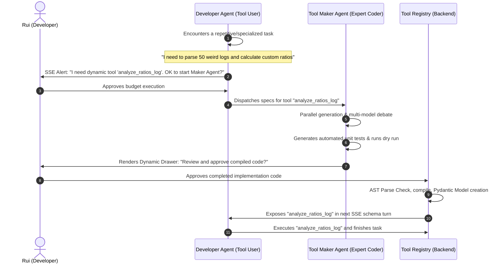

# Self-Assembly Dynamic Tool System (LATM) — Architecture Spec

Dynamic Tool Assembly enables the agent to dynamically create, compile, register, and execute custom Python tools at runtime. This document outlines the orchestration flow, security parameters, and key areas for future improvements.

---

## 1. Orchestration & Interaction Flow

The interaction utilizes a **Tool Maker vs. Tool User** division of labor, secured by a **Two-Tier Human-in-the-Loop (HITL) Wallet Protection** mechanism:




---

## 2. Dynamic Tool Code Specification

Every generated tool is written as a standalone module inside `backend/dynamic_tools/` with a standard layout:

```python
"""
Dynamically generated tool: parse_pdf_table
"""
import os
from pydantic import BaseModel, Field

# 1. Parameter definitions consumed by the registration engine
PARAMS_DEF = {
    "file_path": {
        "type": "string", 
        "description": "Relative path to target PDF file."
    },
    "extract_images": {
        "type": "boolean", 
        "default": False,
        "description": "Extract raw images alongside tables."
    }
}

# 2. Execution logic
def run(file_path: str, extract_images: bool = False) -> str:
    # Core processing logic written by the Tool Maker Agent
    import pypdf  # Standalone or workspace dependencies
    ...
    return f"[SUCCESS] Processed PDF. Extracted {table_count} tables."
```

---

## 3. Places for Future Improvement

When scaling this architecture to a fully production-grade agent developer platform, several critical enhancements should be introduced:

### 🚀 A. Sandbox Execution & Containerization (gVisor / WASM)
*   **The Hazard**: Executing raw, agent-generated Python code on the host machine is a massive security vulnerability. The agent could generate code that accesses host filesystems, environment keys, or system processes.
*   **The Upgrade**: Run dynamically loaded tools inside a **WASM container** (using Wasmtime) or a micro-sandbox (using **gVisor** or a lightweight Docker container). The tool receives the workspace folder mounted as read/write, but is completely cut off from the host operating system, network, and environmental variables.

### 🧪 B. Automated Unit-Testing & Self-Correction (Self-Healing)
*   **The Upgrade**: When the **Tool Maker Agent** writes the custom tool, it must also write a parallel file: `dynamic_tools/test_tool_name.py` containing standard `pytest` unit assertions.
*   **The Loop**:
    1.  The backend runs `pytest backend/dynamic_tools/test_tool_name.py` inside a subprocess.
    2.  If the test passes, the tool is forwarded to the User for approval.
    3.  If the test fails, the traceback is fed back to the **Tool Maker Agent** to repair the code. It repeats this repair loop up to 3 times before presenting it to the user, ensuring the user is never asked to review buggy code.
    4.  If the tool encounters a runtime crash *during* the Developer Agent's execution, the traceback is automatically routed to the Tool Maker for hot-swapping and hot-fixing.

### 📦 C. Dynamic Package Dependency Management
*   **The Upgrade**: Allow the dynamically generated tool to declare pip dependencies:
    ```python
    DEPENDENCIES = ["pypdf>=4.0.0", "openpyxl"]
    ```
*   **The Implementation**: During import time, the registry reads this array, checks if they are installed in the local virtual environment (`venv`), and if missing, safely executes `pip install --no-cache-dir pypdf openpyxl` in the background before importing the tool.

### 👥 D. Highly Intuitive HITL Approval Dashboard
*   **The Upgrade**: An premium UI Drawer in the Next.js frontend showing:
    *   **Side-by-Side View**: The generated tool's code, Pydantic parameters, and docstrings.
    *   **Dry Run logs**: Console logs showing the output of the automated unit test run.
    *   **Quick edit**: Let the user manually tweak a line of the Python tool directly in the UI before hitting "Approve & Register".

### ⚖️ E. Multi-Model Consensus & Debate (MoA) Architecture
*   **The Upgrade**: When the Developer Agent requests a new tool, the system spawns **parallel Tool Maker Agent instances** running on different underlying LLMs (e.g. Claude-3.5-Sonnet, GPT-4o, and Gemini-1.5-Pro) to tackle the task.
*   **The Value of Cognitive Diversity**:
    *   Different LLMs have different biases: GPT-4o might prioritize strict typing and robust OOP structures, while Claude Sonnet excels at highly optimized algorithm design, and Gemini optimizes for raw context and utility speed.
*   **Debate & Cross-Model Review Flow**:
    1.  **Parallel Generation**: Claude, GPT-4o, and Gemini generate their own implementation drafts and Pydantic schemas.
    2.  **Cross-Review**: Each model is shown the drafts of the other two and asked to critique them: *"Find any boundary failures, memory leaks, or unhandled exceptions in your peers' code."*
    3.  **Refinement**: The models refine their plans based on the critiques.
    4.  **Consensus Resolution**:
        *   *Autonomous Route*: A lightweight "Judge" model consolidates the refined implementations into a single unified master candidate.
        *   *User Decision Route*: The HITL UI displays the parallel designs side-by-side: *"Claude's High-Speed Draft vs. GPT-4o's High-Type Safety Draft"*. The user can pick their preferred implementation or let the models merge them!

---

## 4. Academic Analysis: Dynamic Tool Assembly (LATM) vs. In-Workspace Scripting

For university thesis research (**Skripsi / Tugas Akhir**), this system presents a highly compelling comparative study between two distinct software engineering agent paradigms: **Registry-level Tool Assembly (LATM)** and **In-Workspace Script Execution**. 

Below is an academic-grade architectural comparison across key dimensions:

| Architectural Dimension | Paradigm A: Dynamic Tool Assembly (LATM) | Paradigm B: In-Workspace Local Scripting |
|---|---|---|
| **Concept Definition** | Agent dynamically generates a physical tool class, registers its Pydantic schema in the runner, and extends its API surface on-the-fly. | Agent writes standard scripts (`.py` or `.js`) directly into the target project workspace and executes them via standard shell commands. |
| **Portability & Version Control** | ❌ **Low**: Dynamically compiled tools live in the platform wrapper's backend directory, separating the automation tools from the main project's git repository. |  **High**: Scripts are saved inside the project workspace directory (e.g. `scripts/`), committed to Git, and portable across developer environments. |
| **Security & Sandbox Isolation** |  **High**: Built-in runtime sandboxing (e.g. WASM, gVisor) runs the custom tool in total isolation, preventing host resource exposure. | ⚠️ **Medium-Low**: Executing generic scripts in the local environment exposes the entire filesystem unless the terminal runner itself is sandboxed. |
| **Complexity & Overhead** | ⚠️ **High**: Requires real-time import modules, dynamic Pydantic class generation (`create_model`), and multi-model consensus API costs. |  **Low**: Zero-dependency; utilizes standard shell commands (`python scripts/tool.py`) that are already supported by default. |
| **User Agency (HITL)** |  **High**: Clean two-tier UI approval screens allow the developer to review compiled schemas, unit tests, and code side-by-side. | ⚠️ **Medium**: User approves raw terminal command lines (`python scripts/x.py`), but has to manually open the workspace file to review the script. |
| **Reusability** |  **High**: Once a tool is compiled in the platform, it is saved inside the global registry and can be reused across entirely different workspace projects. | ❌ **Low**: The script is tied strictly to the workspace it was written in; other projects cannot access it without duplication. |

### Thesis / Skripsi Research Questions to Explore:
1.  *“What is the correlation between agent success rate and the abstraction level of its tools (API-level tools vs. workspace scripts) during complex, multi-step engineering tasks?”*
2.  *“Does a Multi-Model Consensus & Debate (MoA) architecture in runtime tool generation significantly decrease post-compile syntax failures compared to single-model generation?”*
3.  *“How does the token consumption efficiency of dynamic tool assembly compare to recursive prompt history accumulation during code refactoring?”*


